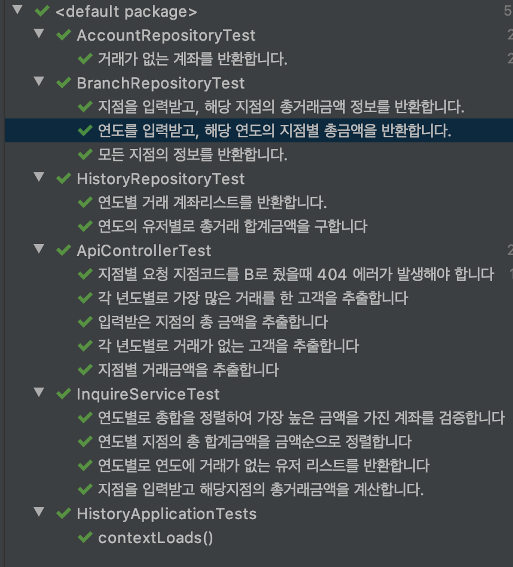

# 2021 고객 거래내역 조회 서비스

### 1. 개발환경
* spring-boot-2.4.2
* java 8
* h2 Database
* lombok
* Jpa
* Querydsl

### 2. 실행항법
~~~
./mvnw install
./mvnw spring-boot:run
~~~

### 3. 요구 및 문제해결
* 데이타를 활용하여 아래 기능명세에 대한 API를 개발하고 각 기능별 Unit Test 코드를 개발.
* 스프링 초기화 시, csv를 읽어 모든 데이터를 메모리 DB로 insert
    * JPA 사용하여 엔티티 구성
#### 3.1 연도별 합계 금액이 가장 많은 고객을 추출하는 API 개발
* 연도는 리스트로 입력 받음 (2018, 2019)
* 입력받은 연도에 대한 계좌정보와, 합계금액을 계산하는 쿼리를 Querydsl을 이용하여 작성
* 취소된 거래에 대해 합산연산을 적용 하지 않음

#### 3.2 거래가 없는 고객을 추출하는 API 개발
 * 찾을 연도를 입력받음 (2018, 2019)
 * 입력받은 연도에 대해 거래가 있는 이력을 리스트로 추출함
 * 취소된 거래에 대해 거래이력으로 조회하지 않음
 * 거래가 있는 리스트를 이용해, 총 계좌 리스트 내에서 해당하는 계좌가 없는 리스트를 추출하는 쿼리를 Querydsl을 이용하여 작성

#### 3.3 연도별 관리점별 합계, 합계금액이 큰 순서대로 출력하는 API 개발
 * 거래내역을 이용하여 찾을 수 있는 연도의 리스트를 querydsl을 이용하여 추출함
 * 해당 연도 리스트를 입력값으로 하여, 지점별 합산금액을 Querydsl을 이용하여 추출 
 * 취소된 거래에 대해 합산연산을 적용 하지 않음

#### 3.4 지점명 입력 시, 해당 지점의 거래금액을 추출하는 API 개발
 * 지점코드를 입력값으로 받음,
 * 해당 지점의 총 거래금액을 추출함
 * 만약 지점코드를 A 입력시, A는 B와 통합 되었으므로, A,B를 통합하여 조회
 * 지점코드 B 입력시, B는 통폐합 되었으므로 404에러 발생 
 * 취소된 거래에 대해 합산연산을 적용 하지 않음
 
### 4. 결과 예시
#### 4.1 연도별 가장 높은거래 금액을 가진 고객
* Request
~~~
request(POST) : http://localhost:8080/api/inquire/amount
Content-Type: application/json
~~~
* Response
~~~json
{
    "code": "000",
    "body": [
        {
            "year": 2018,
            "name": "테드",
            "acctNo": "11111114",
            "sumAmt": 28992000.00
        },
        {
            "year": 2019,
            "name": "에이스",
            "acctNo": "11111112",
            "sumAmt": 40998400.00
        }
    ]
}
~~~

#### 4.2 거래가 없는 고객 추출
* Request
~~~
request(POST) : http://localhost:8080/api/inquire/no/deal/account
Content-Type: application/json
~~~
* Response
~~~json
{
    "code": "000",
    "body": [
        {
            "year": 2018,
            "acctNo": "11111115",
            "acctNm": "사라"
        },
        {
            "year": 2018,
            "acctNo": "11111118",
            "acctNm": "제임스"
        },
        {
            "year": 2018,
            "acctNo": "11111121",
            "acctNm": "에이스"
        },
        {
            "year": 2019,
            "acctNo": "11111114",
            "acctNm": "테드"
        },
        {
            "year": 2019,
            "acctNo": "11111118",
            "acctNm": "제임스"
        },
        {
            "year": 2019,
            "acctNo": "11111121",
            "acctNm": "에이스"
        }
    ]
}
~~~

#### 4.3 연도별 관리점별 합계
* Request
~~~
request(POST) : http://localhost:8080/api/inquire/branch/list
Content-Type: application/json
~~~
* Response
~~~json
{
    "code": "000",
    "body": [
        {
            "year": 2018,
            "dataList": [
                {
                    "brName": "분당점",
                    "brCode": "B",
                    "sumAmt": 38484000.00
                },
                {
                    "brName": "판교점",
                    "brCode": "A",
                    "sumAmt": 20505700.00
                },
                {
                    "brName": "강남점",
                    "brCode": "C",
                    "sumAmt": 20232867.00
                },
                {
                    "brName": "잠실점",
                    "brCode": "D",
                    "sumAmt": 14000000.00
                }
            ]
        },
        {
            "year": 2019,
            "dataList": [
                {
                    "brName": "판교점",
                    "brCode": "A",
                    "sumAmt": 66795100.00
                },
                {
                    "brName": "분당점",
                    "brCode": "B",
                    "sumAmt": 45396700.00
                },
                {
                    "brName": "강남점",
                    "brCode": "C",
                    "sumAmt": 19500000.00
                },
                {
                    "brName": "잠실점",
                    "brCode": "D",
                    "sumAmt": 6000000.00
                }
            ]
        },
        {
            "year": 2020,
            "dataList": [
                {
                    "brName": "을지로점",
                    "brCode": "E",
                    "sumAmt": 1000000.00
                }
            ]
        }
    ]
}
~~~

#### 4.4 지점별 합계금액 ( 성공 )
* Request
~~~
request(POSt) : http://localhost:8080/api/inquire/branch
Content-Type: application/json
input :
{
    "brCode": "A"
}
~~~
* Response
~~~json
{
    "code": "000",
    "body": {
        "brName": "판교점",
        "brCode": "A",
        "sumAmt": 87300800.00
    }
}
~~~

#### 4.5 지점별 합계금액 ( 실패 )
* Request
~~~
request(POSt) : http://localhost:8080/api/inquire/branch
Content-Type: application/json
input : 
{
    "brCode": "B"
}
~~~
* Response
~~~json
{
    "code": "404",
    "body": "br code not found error"
}
~~~

### 5. 테스트

